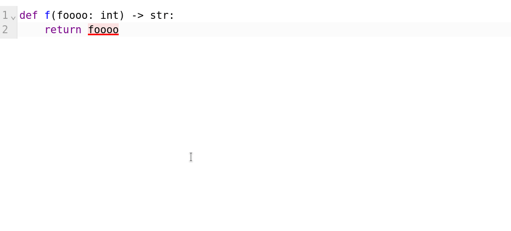

# Pyright playground

Small website that lets you play around with [`pyright`](https://github.com/microsoft/pyright) -- a type checker for Python -- online.

I started this yesterday as of writing this, so it's really basic.

See it in action here: [Pyright playground](https://pyright-playground.decorator-factory.su/)

### Using a source

You can share a code snippet inside the playground. We currently support loading code from a GitHub issue, from a Gist and directly from a string.

#### GitHub issue

In this mode, the playground will load the first Python code block (enclosed within \`\`\`py ... \`\`\`) in an issue

Example: https://pyright-playground.decorator-factory.su/?issue=microsoft/pyright/2662

#### Gist

In this mode, the playground will load a file from a GitHub Gist.

Example: https://pyright-playground.decorator-factory.su/?gist_id=b00b00716dbc9b2115693a1ac8c7db54&filename=example.py

This will render this gist: https://gist.github.com/decorator-factory/b00b00716dbc9b2115693a1ac8c7db54

#### Directly from a string

You can provide a string compressed with `gzip`, encoded in url-safe base64 (`base64.urlsafe_b64encode` in Python)

Example: https://pyright-playground.decorator-factory.su/?gzip=H4sIAPHOr2EC_zXHPQqAMAwG0D2n-OjUgl6goKcI7oKNdOgPMUJ7eyff9kRbgc2e641celMDz56OU4kY2x_v2AWiKwnEWwQvGBG5WsC64zGNBGiyVyvGBxBan4hUAAAA

### TODO:

- [ ] FEATURE: Python version picker
- [ ] FEATURE: Pyright version picker
- [ ] FEATURE: add general Pyright configuration
- [ ] FEATURE: see if it's possible to display tooltips on hover?
- [ ] FEATURE: save snippet to a gist/custom pastebin, like in mypy-play.net
- [ ] BUG: fix newline display in tooltips
- [ ] BUG: fix squiggly lines not showing up if the error is at the end of the file

### Disclaimer

This project is not run by Microsoft or the Pyright team
